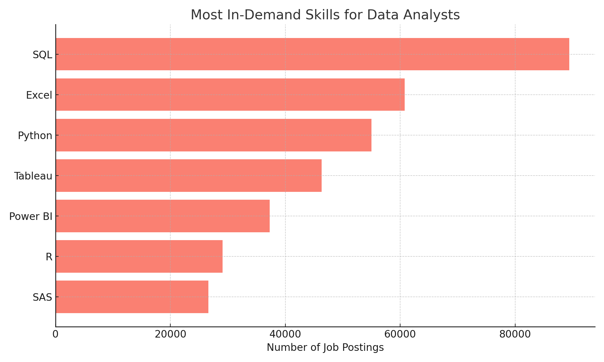
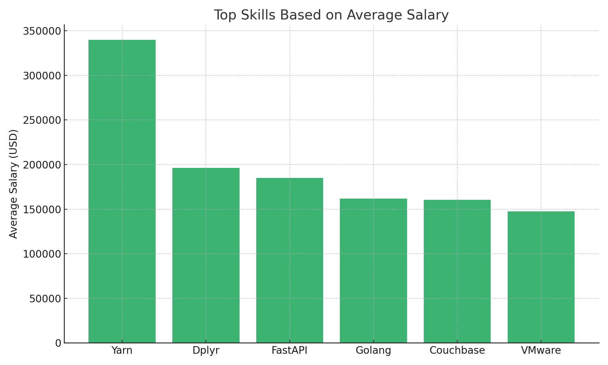
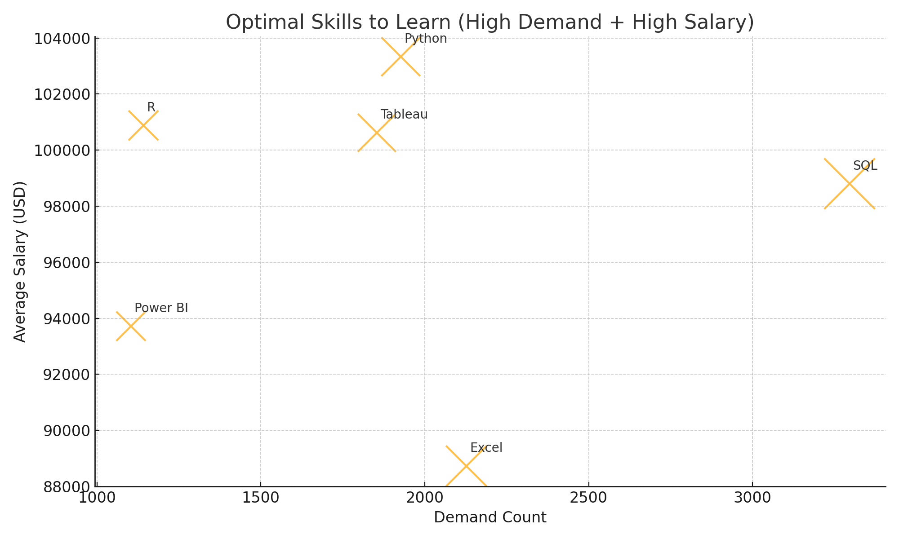

# Data Analyst Job Market Analysis Using SQL
# Introduction
This project explores the job market for Data Analyst roles using SQL. The goal was to identify:
- Top-paying positions
- Required skills for high-paying roles
- Most in-demand skills
- Optimal skills to learn for career growth
By analyzing real job posting data, we uncover insights into compensation trends and skill requirements in the industry.
________________________________________
# Background
With the rise of data-driven decision-making, understanding skills and salaries for Data Analysts is critical. This analysis focuses on:
- High-paying Data Analyst positions
- Remote-friendly skills that pay well
- The most demanded skills in the job market
- Skills that combine demand and high salary
The dataset contains job postings, company details, and associated skills, processed with PostgreSQL, while the workflow was managed using VS Code, Git/GitHub, and pgAdmin4.
________________________________________
# Tools Used

| Tool       | Purpose |
|------------|---------|
| PostgreSQL | Database engine for storing and querying job and skills data |
| pgAdmin4   | GUI tool for managing PostgreSQL databases |
| VS Code    | Writing SQL queries and managing project code |
| Git & GitHub | Version control and project repository management |
| CSV files  | Source data for populating database tables |
________________________________________
# Database Setup and Data Import
## Tables Created:
- company_dim – Stores company details
- skills_dim – Stores skill names and types
- job_postings_fact – Stores job posting details including salary, location, and work-from-home info
- skills_job_dim – Links jobs to required skills
## Performance Improvements:
- Indexes added to foreign key columns for faster queries
- CSV data imported using PostgreSQL COPY commands
________________________________________
# Analysis
## 1. Top-Paying Data Analyst Jobs
## Query 1: Top 10 highest paying Data Analyst positions.
| Job Title | Company | Location | Salary (USD) |
|-----------|---------|----------|--------------|
| Data Analyst | Mantys | Anywhere | 650,000 |
| HC Data Analyst | Illuminate Mission Solutions | Bethesda, MD | 375,000 |
| Senior Data Analyst SME | Modern Technology Solutions | Albuquerque, NM | 375,000 |
| Sr Data Analyst | Illuminate Mission Solutions | Bethesda, MD | 375,000 |
| Data Analyst | Anthropic | San Francisco, CA | 350,000 |
| Senior Data Analyst / Quant Analyst | Eden Smith Group | New York, NY | 340,000 |
| Data Analyst | Anthropic | San Francisco, CA | 240,000 |
| Senior Data Analyst | GradBay | United States | 240,000 |
| Senior Data Analyst | GradBay | New York, NY | 240,000 |
| Investigations & Insights Lead Data Analyst | TikTok | New York, NY | 239,777 |

Insight: Mantys is an outlier, offering exceptionally high compensation.




 

________________________________________
## 2. Skills Required for Top Remote Roles
## Query 2: Skills for highest paying remote roles.

| Job Title | Company | Salary | Skills |
|-----------|---------|--------|--------|
| Associate Director - Data Insights | AT&T | 255,829 | aws, azure, databricks, excel, jupyter, pandas, power bi, powerpoint, pyspark, python, r, sql, tableau |
| Data Analyst, Marketing | Pinterest | 232,423 | hadoop, python, r, sql, tableau |
| Data Analyst (Hybrid/Remote) | UCLA | 217,000 | crystal, flow, oracle, sql, tableau |
| Principal Data Analyst (Remote) | SmartAsset | 205,000 | excel, gitlab, go, numpy, pandas, python, snowflake |

Insight: Technical skills such as SQL, Python, Tableau, and cloud platforms dominate high-paying remote roles.
Visualization Suggestions:
•	Stacked bar chart: Skills per job
•	Word cloud: Most frequent skills across top remote roles
________________________________________
## 3. Most In-Demand Skills
## Query 3: Count of skills across all postings.
| Skill | Demand Count |
|-------|--------------|
| SQL   | 89,431 |
| Excel | 60,793 |
| Python | 55,017 |
| Tableau | 46,306 |
| Power BI | 37,279 |
| R | 29,103 |
| SAS | 26,630 |

Insight: SQL, Excel, Python, and Tableau are core competencies for Data Analysts.
 


________________________________________
## 4. Top Skills Based on Salary
## Query 4: Average salary by skill.
| Skill | Avg Salary (USD) |
|-------|------------------|
| Yarn | 340,000 |
| Dplyr | 196,250 |
| FastAPI | 185,000 |
| Golang | 161,750 |
| Couchbase | 160,515 |
| VMware | 147,500 |

Insight: Niche technical skills like Yarn, Dplyr, FastAPI are associated with higher pay.
 


Visualization________________________________________
## 5. Optimal Skills to Learn (High Demand + High Salary)
## Query 5: Combine demand and salary to identify valuable skills.

| Skill | Demand Count | Avg Salary (USD) |
|-------|--------------|------------------|
| SQL | 3,296 | 98,902 |
| Excel | 2,127 | 88,729 |
| Python | 1,927 | 103,332 |
| Tableau | 1,854 | 100,619 |
| R | 1,142 | 100,880 |
| Power BI | 1,104 | 93,718 |

Insight: SQL, Python, Tableau, and R provide the best combination of demand and pay, making them essential for career growth.
 




________________________________________
## Learnings
- Mastered complex SQL queries, including JOINs, CTEs, and aggregations
- Gained career insights into high-paying and in-demand skills
- Experienced in database setup, CSV imports, and data cleaning
- Identified optimal skills based on real-world demand and compensation
________________________________________
## Conclusion
This SQL project provides a structured analysis of the Data Analyst job market. Professionals can leverage these insights to:
- Target high-paying roles
- Focus on in-demand, high-value skills
- Make informed career development decisions

# Appendix: Database Setup and SQL Queries
This appendix documents the PostgreSQL schema, data loading scripts, and SQL queries used for this project. All queries were executed in PostgreSQL, with development managed in VS Code, Git, GitHub, and pgAdmin4.
## 1. Database Schema
```sql
-- Create company_dim table
CREATE TABLE public.company_dim (
    company_id INT PRIMARY KEY,
    name TEXT,
    link TEXT,
    link_google TEXT,
    thumbnail TEXT
);

-- Create skills_dim table
CREATE TABLE public.skills_dim (
    skill_id INT PRIMARY KEY,
    skills TEXT,
    type TEXT
);

-- Create job_postings_fact table
CREATE TABLE public.job_postings_fact (
    job_id INT PRIMARY KEY,
    company_id INT,
    job_title_short VARCHAR(255),
    job_title TEXT,
    job_location TEXT,
    job_via TEXT,
    job_schedule_type TEXT,
    job_work_from_home BOOLEAN,
    search_location TEXT,
    job_posted_date TIMESTAMP,
    job_no_degree_mention BOOLEAN,
    job_health_insurance BOOLEAN,
    job_country TEXT,
    salary_rate TEXT,
    salary_year_avg NUMERIC,
    salary_hour_avg NUMERIC,
    FOREIGN KEY (company_id) REFERENCES public.company_dim (company_id)
);

-- Create skills_job_dim table
CREATE TABLE public.skills_job_dim (
    job_id INT,
    skill_id INT,
    PRIMARY KEY (job_id, skill_id),
    FOREIGN KEY (job_id) REFERENCES public.job_postings_fact (job_id),
    FOREIGN KEY (skill_id) REFERENCES public.skills_dim (skill_id)
);

-- Set ownership
ALTER TABLE public.company_dim OWNER TO postgres;
ALTER TABLE public.skills_dim OWNER TO postgres;
ALTER TABLE public.job_postings_fact OWNER TO postgres;
ALTER TABLE public.skills_job_dim OWNER TO postgres;

-- Indexes
CREATE INDEX idx_company_id ON public.job_postings_fact (company_id);
CREATE INDEX idx_skill_id ON public.skills_job_dim (skill_id);
CREATE INDEX idx_job_id ON public.skills_job_dim (job_id);
==============================================================
2. Data Import (CSV Load)
COPY company_dim
FROM 'D:\MOSTAFA\2024\PythonSQL\Hello Python\SQL_PROJECT_DATA_JOB_ANALYSIS\csv_files\company_dim.csv'
WITH (FORMAT csv, HEADER true, DELIMITER ',', ENCODING 'UTF8');

COPY skills_dim
FROM 'D:\MOSTAFA\2024\PythonSQL\Hello Python\SQL_PROJECT_DATA_JOB_ANALYSIS\csv_files\skills_dim.csv'
WITH (FORMAT csv, HEADER true, DELIMITER ',', ENCODING 'UTF8');

COPY job_postings_fact
FROM 'D:\MOSTAFA\2024\PythonSQL\Hello Python\SQL_PROJECT_DATA_JOB_ANALYSIS\csv_files\job_postings_fact.csv'
WITH (FORMAT csv, HEADER true, DELIMITER ',', ENCODING 'UTF8');

COPY skills_job_dim
FROM 'D:\MOSTAFA\2024\PythonSQL\Hello Python\SQL_PROJECT_DATA_JOB_ANALYSIS\csv_files\skills_job_dim.csv'
WITH (FORMAT csv, HEADER true, DELIMITER ',', ENCODING 'UTF8');
==============================================================
3. Analytical Queries
Query 1: Top Paying Data Analyst Jobs
SELECT j.job_id,
       j.job_title,
       j.job_title_short,
       j.job_location,
       c.name AS company_name,
       j.salary_year_avg
FROM job_postings_fact j
JOIN company_dim c ON j.company_id = c.company_id
WHERE j.job_title ILIKE '%Data Analyst%'
  AND j.salary_year_avg IS NOT NULL
ORDER BY j.salary_year_avg DESC
LIMIT 10;

Query 2: Skills Required for Top Remote Roles
WITH top_remote_jobs AS (
    SELECT j.job_id,
           j.job_title,
           j.job_title_short,
           j.job_location,
           c.name AS company_name,
           j.salary_year_avg
    FROM job_postings_fact j
    JOIN company_dim c ON j.company_id = c.company_id
    WHERE j.job_title_short ILIKE '%Data Analyst%'
      AND j.job_work_from_home = TRUE
      AND j.salary_year_avg IS NOT NULL
    ORDER BY j.salary_year_avg DESC
    LIMIT 10
)
SELECT tj.job_id,
       tj.job_title,
       tj.job_title_short,
       tj.company_name,
       tj.salary_year_avg,
       s.skills
FROM top_remote_jobs tj
JOIN skills_job_dim sjd ON tj.job_id = sjd.job_id
JOIN skills_dim s ON sjd.skill_id = s.skill_id
ORDER BY tj.salary_year_avg DESC, tj.job_id, s.skills;

Query 3: Most In-Demand Skills
SELECT s.skills,
       COUNT(*) AS demand_count
FROM job_postings_fact j
JOIN skills_job_dim sjd ON j.job_id = sjd.job_id
JOIN skills_dim s ON sjd.skill_id = s.skill_id
WHERE j.job_title ILIKE '%Data Analyst%'
GROUP BY s.skills
ORDER BY demand_count DESC
LIMIT 20;

Query 4: Top Skills Based on Salary
SELECT s.skills,
       ROUND(AVG(j.salary_year_avg), 0) AS avg_salary
FROM job_postings_fact j
JOIN skills_job_dim sjd ON j.job_id = sjd.job_id
JOIN skills_dim s ON sjd.skill_id = s.skill_id
WHERE j.job_title ILIKE '%Data Analyst%'
  AND j.salary_year_avg IS NOT NULL
GROUP BY s.skills
ORDER BY avg_salary DESC
LIMIT 20;

Query 5: Optimal Skills to Learn (High Demand + High Pay)
SELECT s.skills,
       COUNT(*) AS demand_count,
       ROUND(AVG(j.salary_year_avg), 0) AS avg_salary
FROM job_postings_fact j
JOIN skills_job_dim sjd ON j.job_id = sjd.job_id
JOIN skills_dim s ON sjd.skill_id = s.skill_id
WHERE j.job_title ILIKE '%Data Analyst%'
  AND j.salary_year_avg IS NOT NULL
GROUP BY s.skills
ORDER BY demand_count DESC, avg_salary DESC
LIMIT 20;

